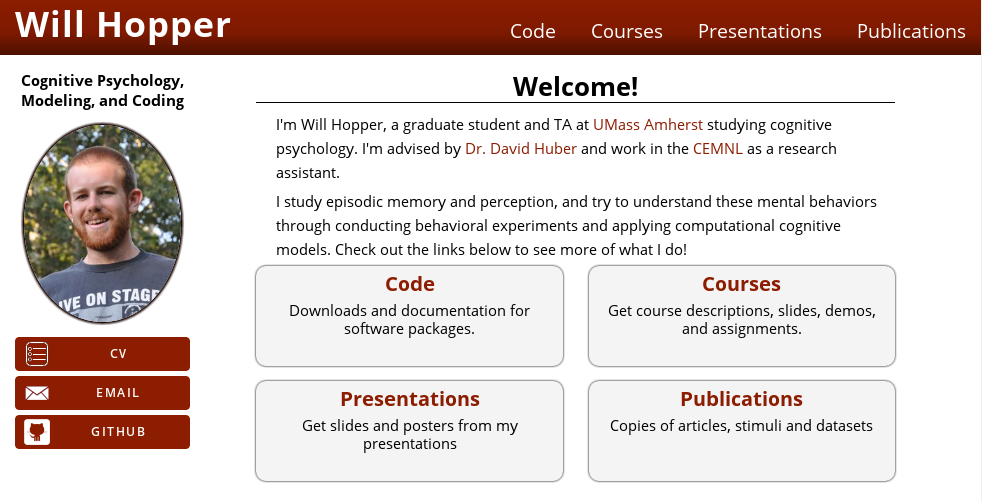

# academia
A responsive theme for the [Pelican](http://blog.getpelican.com/) Static Site Generator, powered by [Python](https://www.python.org/).
See it in action at http://people.umass.edu/whopper

## Screenshots
#### Larger Screens

#### Smaller Screens


## Installation
If you don't have an existing Pelican project, see the [Pelican Quickstart](http://docs.getpelican.com/en/3.6.3/quickstart.html) guide to get up and running. It is recommended you read the rest of the [Documentation](http://docs.getpelican.com/en/3.6.3/) as well, to make better use of Pelican.

1. Clone the repository

  ```
  $ git clone https://github.com/wjhopper/academia.git
  ```
2. Install the theme

  ```
  $ pelican-themes -i /path/to/cloned/repository
  ```
3. Create a `THEME` variable in your `pelicanconf.py` file and set its value to `academia`.

  ```python
  THEME = 'academia'
  ```
4. Add the following code to your `pelicanconf.py` file to fill in the content of the sidebar and the navbar.

  ```python
  AUTHOR = 'Your Name'
  SITESUBTITLE = 'Your subtitle goes here'
  AVATAR = 'path/to/your/picture.jpg'
  LINKS = (('cv', 'path/to/your/CV.pdf'),
           ('email', 'mailto:username@domain_name'),
           ('github', 'https://github.com/your_real_username'))
  ```

5. To see your site and test out changes, start up the development web server by running `make devserver` in the directory where your Pelican site is set up, and navigate your web browser to http://localhost:8000

If you are having trouble seeing/downloading the content of static files or other resources, try setting `RELATIVE_URLS = True` in your  `pelicanconf.py`.

For information on publishing your site, read the [publishing docs](http://docs.getpelican.com/en/3.6.3/publish.html)
